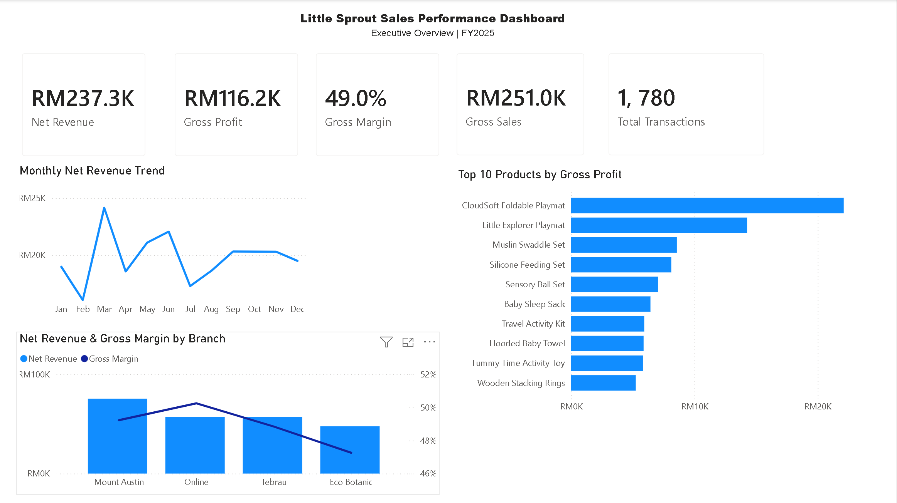

# Little Sprout Sales Performance Analysis

## Project Overview

This project analyzes 1,780 FY2025 Retail and E-Commerce transactions for Little Sprout, a fictional retail business.

The analysis was developed in Power BI to evaluate overall sales and profitability, identify performance differences across products, branches, and sales channels, and investigate the drivers behind changes in business performance.

A focused root-cause analysis was also conducted to understand the significant increase in E-Commerce revenue in March.

## Business Questions

This analysis aims to answer the following questions:

- How did overall sales and profitability perform in FY2025?
- Which products, categories, and branches contributed most to business performance?
- How did Retail and E-Commerce channels perform differently?
- What caused the significant increase in E-Commerce revenue in March?
- Was the change in revenue driven by transaction volume, units sold, pricing, or product mix?

## Dashboard Preview

